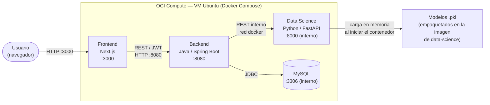
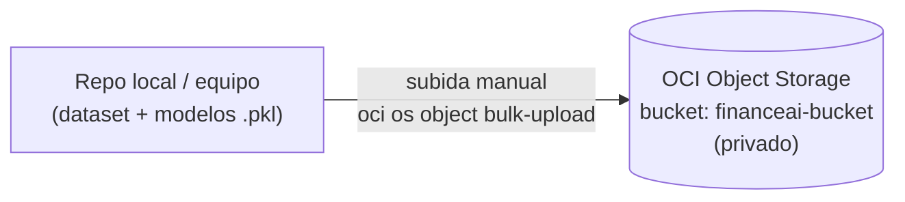

# Arquitectura — Finance IA

Este documento explica cómo interactúan los componentes del sistema: el backend en **Java**, el microservicio de IA en **Python**, y la infraestructura en **OCI** (Compute y Object Storage). Hay dos flujos distintos que conviene no mezclar:

1. **Flujo de una petición en vivo** (lo que pasa cuando un usuario usa la app).
2. **Flujo de respaldo de datos** (cómo el dataset y los modelos `.pkl` quedan resguardados en OCI Object Storage).

---

## 1. Flujo de una petición en vivo

Todo corre dentro de una sola VM de OCI Compute, orquestado con Docker Compose. Los 4 servicios están en la misma red interna de Docker y se comunican por nombre de contenedor.

**Cómo se comunican:**
- El **navegador** habla directo con el **frontend** (puerto 3000) y con el **backend** (puerto 8080) — ambos publicados al público en la VM.
- El **backend (Java)** le pide predicciones al **microservicio de IA (Python)** por HTTP, usando el nombre del contenedor (`data-science:8000`) dentro de la red interna de Docker — este puerto **no** está expuesto a internet.
- El **backend** guarda y lee usuarios/transacciones en **MySQL** — tampoco expuesto a internet.
- El microservicio de **Python** carga los archivos `.pkl` (clasificador de gastos, codificador de perfil, perfil financiero) **desde el propio contenedor**, no desde OCI Object Storage — los modelos viajan empaquetados dentro de la imagen Docker que se construye en cada deploy.

---

## 2. Flujo de respaldo en OCI Object Storage

Separado del flujo anterior. **OCI Object Storage no participa en las peticiones en vivo** — es un resguardo manual del dataset original y los modelos entrenados, por si se pierden localmente o hay que reentrenar.

**Contenido del bucket `financeai-bucket` (privado):**

| Archivo | Qué es |
| :--- | :--- |
| `Expenses_clean.csv` | Dataset original de entrenamiento |
| `clasificador_gastos.pkl` | Modelo entrenado — clasificación de gastos |
| `codificador_perfil.pkl` | Modelo entrenado — codificador de perfil |
| `perfil_financiero.pkl` | Modelo entrenado — perfil financiero |
| `SHA256SUMS` | Checksums para verificar integridad del respaldo |

---

## 3. Resumen de componentes

| Componente | Tecnología | Rol | Expuesto a internet |
| :--- | :--- | :--- | :--- |
| Frontend | Next.js | Interfaz de usuario | Sí (:3000) |
| Backend | Java 21 / Spring Boot | API REST, auth, orquesta las llamadas a IA y a la BD | Sí (:8080) |
| Data Science | Python 3.11 / FastAPI | Sirve los modelos de ML (predicciones) | No (solo red interna) |
| Base de datos | MySQL 8.0 | Persistencia de usuarios, transacciones, historial | No (solo red interna) |
| OCI Compute | VM.Standard3.Flex (2 OCPU/16GB) | Host único donde corre todo el stack vía Docker Compose | — (es la infraestructura, no un servicio) |
| OCI Object Storage | Bucket `financeai-bucket` | Respaldo del dataset y modelos entrenados | No (bucket privado) |

---

## 4. Por qué está separado así

- **Simplicidad para el MVP del hackatón**: un solo servidor con todo adentro es más fácil de desplegar y depurar en poco tiempo que una arquitectura distribuida.
- **Los modelos van empaquetados en la imagen** (no se leen de Object Storage en producción) para que el microservicio de IA no dependa de una llamada de red externa para responder — más rápido y con menos puntos de falla durante la demo.
- **Object Storage es el "plan B"**: si se pierde el dataset o los `.pkl` localmente, o el equipo necesita reentrenar, el respaldo en `financeai-bucket` es la fuente de recuperación.
