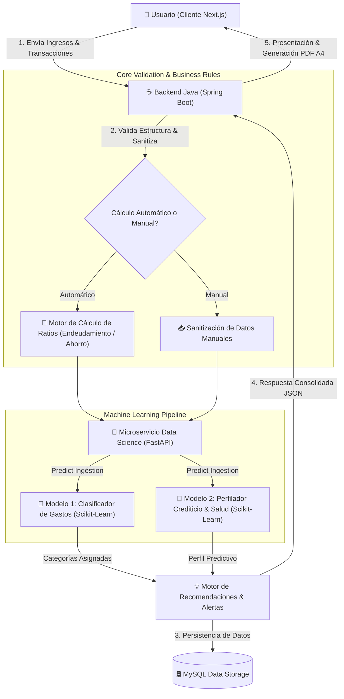
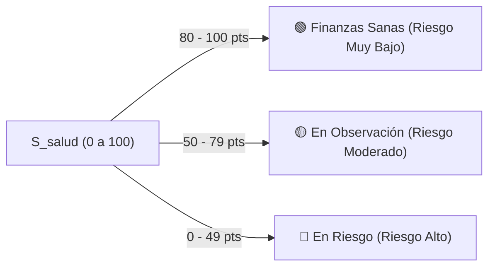
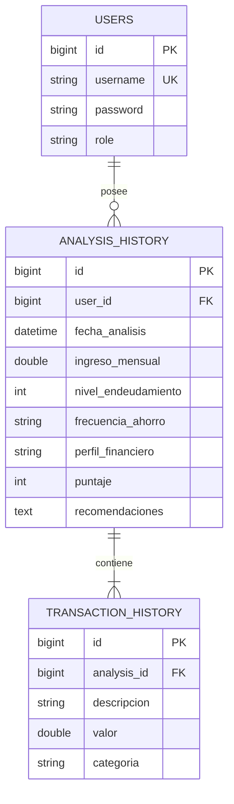

# 📘 REGLAS DE NEGOCIO, ARQUITECTURA Y LÓGICA DE IA
### Documento de Especificación Técnica e Inteligencia Financiera
**Proyecto:** Finance AI — Plataforma de Gestión y Diagnóstico Financiero con IA  
**Organización:** No Country Simulation — G9 LATAM Team 38  
**Autor Principal & Lead Technical Architect:** Marco Arias (Backend & Data/IA Lead)  
**Versión:** 0.0.1 (MVP Snapshot) | **Estado:** Aprobado & En Producción  

---

## 🏛️ 1. Resumen Ejecutivo y Alcance
El presente documento constituye la especificación formal y autoritativa de las **Reglas de Negocio**, **Modelos Matemáticos**, **Lógica de Inferencia de Inteligencia Artificial** y **Políticas de Mantenimiento de Datos** de la plataforma **Finance AI**.

Este artefacto técnico sirva como marco de referencia definitivo para ingenieros de software, científicos de datos, auditores de producto y partes interesadas.

### 📊 Ficha Técnica del Sistema
| Parámetro | Detalle Técnico |
| :--- | :--- |
| **Arquitectura** | Microservicios Desacoplados (Frontend Next.js + Backend Java Spring Boot + Data Science FastAPI + MySQL 8.0) |
| **Modelos de ML** | Clasificador de Gastos (`clasificador_gastos.pkl`) + Profiler Crediticio (`perfil_financiero.pkl`) |
| **Persistencia (Data Storage)** | MySQL 8.0 con relacional de usuarios, transacciones e historial analítico (`analysis_history`, `transaction_history`) |
| **Protocolos de Inferencia** | REST HTTP/JSON con Fallback Automático por Heurística Léxica |

---

## 🔄 2. Arquitectura de Flujo de Datos y Decisiones

---

## 📐 3. Formulación Matemática de Reglas Financieras

### 3.1. Ratio e Índice de Endeudamiento ($\%E$)
El nivel de endeudamiento evalúa la presión financiera ejercida por los gastos identificados sobre los ingresos mensuales declarados.

$$\%E = \left( \frac{\sum_{i=1}^{n} T_i}{I_{\text{mensual}}} \right) \times 100$$

Donde:
- $T_i$: Monto de la transacción de gasto $i$.
- $I_{\text{mensual}}$: Ingreso mensual del usuario ($I_{\text{mensual}} > 0$).

#### 🎯 Umbrales de Riesgo de Endeudamiento:
$$\text{Categoría de Endeudamiento} = 
\begin{cases} 
\text{Saludable (Bajo)}, & 0\% \le \%E \le 30\% \\
\text{Moderado}, & 31\% \le \%E \le 50\% \\
\text{Elevado (En Riesgo)}, & 51\% \le \%E \le 90\% \\
\text{Crítico (Sobrendeudado)}, & \%E > 90\%
\end{cases}$$

> **🛡️ Regla de Control de Frontera (Clamping de Inferencia):**  
> Para evitar errores de validación de frontera en la IA ($422\text{ Unprocessable Entity}$ de Pydantic), el Backend Java aplica la función de saturación antes de transmitir el payload al microservicio de Python:
> $$\%E_{\text{clamped}} = \min(100, \max(0, \%E))$$

---

### 3.2. Ratio de Margen Libre y Capacidad de Ahorro ($\%A$)
El margen libre financiero determina la liquidez remanente disponible para inversión o fondo de emergencia.

$$\text{Margen Libre } (M_L) = I_{\text{mensual}} - \sum_{i=1}^{n} T_i$$

$$\text{Ratio de Ahorro } (R_A) = \frac{M_L}{I_{\text{mensual}}}$$

#### 📈 Matriz de Clasificación de Frecuencia de Ahorro:
$$\text{Frecuencia de Ahorro} = 
\begin{cases} 
\mathbf{Muy\ Alta}, & R_A \ge 0.40 \text{ (Margen libre } \ge 40\%) \\
\mathbf{Alta}, & 0.25 \le R_A < 0.40 \text{ (Margen libre } 25\% - 39\%) \\
\mathbf{Media}, & 0.10 \le R_A < 0.25 \text{ (Margen libre } 10\% - 24\%) \\
\mathbf{Baja}, & 0.00 \le R_A < 0.10 \text{ (Margen libre } 0\% - 9\%) \\
\mathbf{Nula}, & R_A < 0.00 \text{ (Gastos superan a los ingresos - Déficit)}
\end{cases}$$

---

### 3.3. Algoritmo de Scoring Combinado de Salud Financiera ($S_{\text{salud}}$)
El puntaje de salud financiera es un índice entero ponderado en una escala de 0 a 100 puntos:

$$S_{\text{salud}} = P_{\text{ahorro}} + P_{\text{endeudamiento}} + P_{\text{distribución}}$$

#### Desglose de Puntos:
1. **Puntaje por Ahorro ($P_{\text{ahorro}}$):**
   - Muy Alta: $40\text{ pts}$ | Alta: $30\text{ pts}$ | Media: $20\text{ pts}$ | Baja: $10\text{ pts}$ | Nula: $0\text{ pts}$
2. **Puntaje por Endeudamiento ($P_{\text{endeudamiento}}$):**
   - $\%E \le 30\%$: $40\text{ pts}$ | $31\% \le \%E \le 50\%$: $20\text{ pts}$ | $\%E > 50\%$: $0\text{ pts}$
3. **Puntaje por Distribución de Gasto ($P_{\text{distribución}}$):**
   - Ratio Gasto/Ingreso $< 70\%$: $20\text{ pts}$ | $70\% - 90\%$: $10\text{ pts}$ | $> 90\%$: $0\text{ pts}$

#### Matriz de Estado de Salud Resultante:

---

## 🤖 4. Modelos de Machine Learning y MLOps

### 4.1. Clasificador Multiclase de Movimientos (`clasificador_gastos.pkl`)
- **Protocolo:** `POST /clasificar-transaccion`
- **Técnica:** Supervised Learning (Random Forest / Logistic Regression) entrenado con dataset etiquetado de finanzas personales LATAM.
- **Categorías del Modelo:**
  1. 🛒 `Alimentacion` (Supermercados, restaurantes, abarrotes)
  2. 🚗 `Transporte` (Gasolina, Uber, pasajes, mantenimiento vehicular)
  3. 🏠 `Vivienda` (Renta, alquiler, hipoteca, mantenimiento)
  4. 💡 `Servicios` (Luz, agua, internet, telefonía, gas)
  5. 🏥 `Salud` (Farmacia, consultas médicas, seguros)
  6. 📚 `Educación` (Matrícula, libros, cursos, universidad)
  7. 🎬 `Ocio` (Cine, videojuegos, viajes, entretenimiento)
  8. 📦 `Otros` (Gastos no categorizables)

#### 🛡️ Mecanismo de Fallback Heurístico (Resiliencia Avanzada):
Si la conexión con FastAPI falla o el texto es ambiguo, el motor Java activa la clasificación léxica por patrones de expresiones regulares:
$$\text{Fallback}(T_{\text{desc}}) = 
\begin{cases}
\text{Alimentacion}, & T_{\text{desc}} \in \{\text{super, comida, carne, despensa, mercado}\} \\
\text{Ocio}, & T_{\text{desc}} \in \{\text{cine, juego, steam, netflix, spot}\} \\
\text{Transporte}, & T_{\text{desc}} \in \{\text{uber, gasolina, auto, peaje, taxi}\} \\
\text{Vivienda}, & T_{\text{desc}} \in \{\text{alquiler, renta, casa, depa}\} \\
\text{Servicios}, & T_{\text{desc}} \in \{\text{luz, agua, internet, servicio, wifi}\} \\
\text{Salud}, & T_{\text{desc}} \in \{\text{farmacia, medica, salud, doctor}\} \\
\text{Educación}, & T_{\text{desc}} \in \{\text{libro, escuela, universidad, curso}\} \\
\text{Otros}, & \text{en otro caso}
\end{cases}$$

---

## 📋 5. Catálogo de Reglas de Negocio del Sistema (BRE)

| ID Regla | Nombre de Regla | Condición de Disparo | Acción / Resultado Generado | Prioridad |
| :--- | :--- | :--- | :--- | :--- |
| **BRE-001** | Validar Ingreso Mínimo | $I_{\text{mensual}} \le 0$ o nulo | Bloquear análisis con mensaje: *"El ingreso mensual debe ser un valor superior a 0."* | Alta |
| **BRE-002** | Validar Gastos Positivos | $T_i \le 0$ o nulo | Rechazar transacción con HTTP 400 Bad Request. | Alta |
| **BRE-003** | Alerta de Gasto Dominante | $\exists T_i \mid T_i > 0.20 \times I_{\text{mensual}}$ | Emitir sugerencia: `[ALERTA] El gasto en '{desc}' supera el límite preventivo recomendado por transacción.` | Media |
| **BRE-004** | Alerta Sobrendeudamiento | $\%E > 50\%$ | Emitir recomendación: `Alerta: Su nivel de endeudamiento supera los límites recomendados. Evite adquirir nuevos créditos.` | Alta |
| **BRE-005** | Optimización de Categoría Mayoritaria | $\max(\text{MontoByCategoria})$ | Emitir recomendación: `Se recomienda reducir gastos en la categoría de {categoria_mayoritaria}.` | Media |
| **BRE-006** | Persistencia State Sync | Cambio de estado o navegación | Guardar/Restaurar instantáneamente `ingresoMensual`, `transacciones` y `resultado` en Data Storage. | Alta |

---

## 🛢️ 6. Modelo de Datos y Persistencia (Data Storage - MySQL 8.0)

La persistencia relacional se gestiona mediante JPA/Hibernate sobre MySQL 8.0, garantizando integridad referencial y auditable:

---

## 🏛️ 7. Gobernanza y Mantenimiento del Documento
- **Frecuencia de Revisión:** Trimestral o ante cada release mayor de modelos de Machine Learning.
- **Responsables de Firma:**
  - **Lead Backend & AI Architecture:** Marco Arias
  - **QA & Security Reviewer:** Equipo G9 LATAM Team 38
